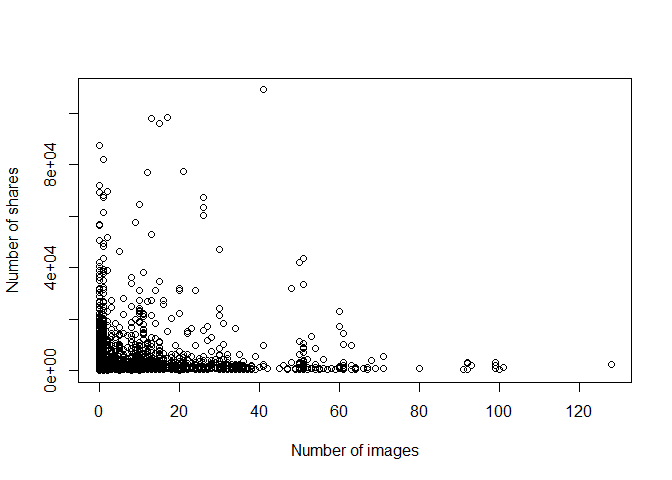
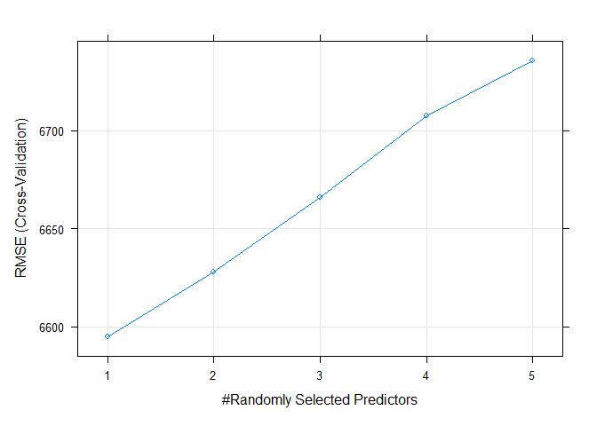

Entertainment News Analysis
================
Kelley Breeze and Chuanni He
2022-10-31

- <a href="#introduction" id="toc-introduction">Introduction</a>
- <a href="#data" id="toc-data">Data</a>
- <a href="#subset-the-data" id="toc-subset-the-data">Subset the data</a>
- <a href="#summarizations" id="toc-summarizations">Summarizations</a>
  - <a href="#shares-variable" id="toc-shares-variable"><code>Shares</code>
    Variable</a>
  - <a href="#relationship-between-shares-and-number-of-images"
    id="toc-relationship-between-shares-and-number-of-images">Relationship
    Between <code>Shares</code> and Number of Images</a>
  - <a href="#correlation-between-numeric-variables"
    id="toc-correlation-between-numeric-variables">Correlation between
    Numeric Variables</a>
  - <a href="#does-weekend-impact-the-shares-variable"
    id="toc-does-weekend-impact-the-shares-variable">Does Weekend Impact the
    <code>Shares</code> Variable?</a>
  - <a href="#contingency-tables" id="toc-contingency-tables">Contingency
    Tables</a>
  - <a href="#summary-statistics-on-postive-and-negative-word-rates"
    id="toc-summary-statistics-on-postive-and-negative-word-rates">Summary
    Statistics on Postive and Negative Word Rates</a>
  - <a
    href="#scatterplot-investigating-positive-word-rate-shares-and-number-of-images"
    id="toc-scatterplot-investigating-positive-word-rate-shares-and-number-of-images">Scatterplot
    Investigating Positive Word Rate, Shares, and Number of Images</a>
  - <a
    href="#scatterplot-investigating-negative-word-rate-shares-and-number-of-images"
    id="toc-scatterplot-investigating-negative-word-rate-shares-and-number-of-images">Scatterplot
    Investigating Negative Word Rate, Shares, and Number of Images</a>
- <a href="#modeling" id="toc-modeling">Modeling</a>
  - <a href="#spliting-the-data" id="toc-spliting-the-data">Spliting the
    Data</a>
  - <a href="#ensemble-models" id="toc-ensemble-models">Ensemble Models</a>
    - <a href="#random-forest-model" id="toc-random-forest-model">Random
      Forest Model</a>
    - <a href="#boosted-tree-model" id="toc-boosted-tree-model">Boosted Tree
      Model</a>
  - <a href="#linear-regression-models"
    id="toc-linear-regression-models">Linear Regression Models</a>
    - <a href="#first-linear-regression-model-lmod1"
      id="toc-first-linear-regression-model-lmod1">First Linear Regression
      Model <code>lmod1</code></a>
    - <a href="#second-linear-regression-model-lmod2"
      id="toc-second-linear-regression-model-lmod2">Second Linear Regression
      Model <code>lmod2</code></a>
- <a href="#comparison" id="toc-comparison">Comparison</a>

# Introduction

This report contains a set of predictive models with automating
mechanism. The data to be analyzed is the Online News Popularity Data
Set summarizing a heterogeneous set of features about articles published
by Mashable in a period of two years. The goal is to predict the number
of shares in social networks (popularity). The dataset contains 39,644
observations with 61 variables.

In this project, we selected a subset of the variables as the predictor.
Detailed descriptions for the predicting variables are listed below.

- `n_tokens_title`: Number of words in the title.  
- `n_tokens_content`: Number of words in the content.
- `n_unique_tokens`: Rate of unique words in the content.  
- `average_token_length`: Average length of the words in the content.  
- `num_keywords`: Number of keywords in the metadata.  
- `num_hrefs`: Number of links.  
- `num_imgs`: Number of images.  
- `num_videos`: Number of videos.  
- `kw_min_min`: Worst keyword (min. shares).  
- `kw_max_min`: Worst keyword (max. shares).  
- `self_reference_min_shares`: Min. shares of referenced articles in
  Mashable.  
- `self_reference_max_shares`: Max. shares of referenced articles in
  Mashable.  
- `weekday_is_friday`: Was the article published on a Friday?  
- `weekday_is_saturday`: Was the article published on a Saturday?  
- `global_rate_positive_words`: Rate of positive words in the content.  
- `global_rate_negative_words`: Rate of negative words in the content.

The target variables is the `shares` variable indicating number of
shares (target). The purpose of this project is to identify the optimal
predicting variables and methods to predict the number of shares. This
project applied statistical prediction models such as linear regression,
random forest model, and boosted tree model.

# Data

The code below uses a relative file path to import our data.

``` r
onlineNewsData<-read_csv('OnlineNewsPopularity.csv')
```

# Subset the data

We will create a new variable `data_channel` representing all data
channels, and remove the six data channel variables. Next, we will clean
up the dataset to only include predicting variables and the response
variable.

``` r
data_channel = rep(NA,nrow(onlineNewsData[,1]))
for (i in 1:nrow(onlineNewsData[,1])) {
  if (onlineNewsData$data_channel_is_lifestyle[i]==1) {data_channel[i]="Lifestyle"} 
  else if (onlineNewsData$data_channel_is_entertainment[i]==1) {data_channel[i]="Entertainment"}
  else if (onlineNewsData$data_channel_is_bus[i]==1) {data_channel[i]="Business"}
  else if (onlineNewsData$data_channel_is_socmed[i]==1) {data_channel[i]="SocialMedia"}
  else if (onlineNewsData$data_channel_is_tech[i]==1) {data_channel[i]="Tech"}
  else if (onlineNewsData$data_channel_is_world[i]==1) {data_channel[i]="World"}
  else {data_channel[i]=NA}
}

onlineNewsData = onlineNewsData[,-c(14:19)]

onlineNewsData = cbind(onlineNewsData,data_channel)

onlineNewsData = onlineNewsData %>% 
  select(data_channel,n_tokens_title,n_tokens_content,n_unique_tokens,
         average_token_length,num_keywords,num_hrefs,num_imgs,num_videos,
         kw_min_min,kw_max_min,self_reference_min_shares,self_reference_max_shares,
         weekday_is_friday,weekday_is_saturday,global_rate_positive_words,
         global_rate_negative_words,shares) %>% filter(data_channel==params$channel)
```

# Summarizations

Before we begin our analysis we first want to split the data into a
training and test set. Once this is done we can move on to summarizing
the training data to look at the basic distribution of our selected
variables.

``` r
set.seed(123)
train = sample(1:nrow(onlineNewsData), size = nrow(onlineNewsData)*0.7)
test = setdiff(1:nrow(onlineNewsData), train)
dat_train <- onlineNewsData[train, ]
dat_test <- onlineNewsData[test, ]
```

<br>  
<br>

### `Shares` Variable

The response variable that we are interested in is the `shares`
variable. Let’s look at some basic summary statistics for the `shares`
variable. The `summary()` function will give us the five number summary
for our `shares` variable. This includes the minimum and maximum values,
as well as 1st quartile, median, and 3rd quartile values. The five
number summary provides useful insight into the spread of our data,
provides initial evidence of outliers in our data set that might need to
be explored further, and also gives us an idea about the possible skew
of our data.

<br>

#### Summary Statictics on the `Shares` Variable

``` r
summary(dat_train$shares)
```

    ##    Min. 1st Qu.  Median    Mean 3rd Qu.    Max. 
    ##      47     832    1200    2938    2100  109100

<br>

#### `Shares` Variable Histogram

Let’s also look at a histogram for the `shares` variable to get another
look at the spread and skew of this variable. Note that the presence of
extreme outliers will impact the scale of the x-axis, and will change
the resulting shape of the histogram.

``` r
ggplot(dat_train, aes(x=shares)) + 
  geom_histogram(binwidth = 3000) + 
  labs(x="Total Shares", y="Number of Articles", title = "Histogram of Number of Article Shares")
```

<!-- -->

<br>  
<br>

### Relationship Between `Shares` and Number of Images

Next we will do some summarization statistics and plots. We will first
make a scatter plot showing the relationship between `share` and
`num_image`. If the points show an upward trend, then articles with more
images tend to be shared more often. If we see a negative trend then
articles with more images tend to be shared less often.

``` r
plot(dat_train$num_imgs,dat_train$shares,type = "point",xlab = "Number of images",
     ylab = "Number of shares")
```

<!-- -->

<br>  
<br>

### Correlation between Numeric Variables

Next, we want to investigate the correlation between numeric variables.
If the correlation coefficient is large and positive with `share`, then
the higher the value of the corresponding variable, the more shares it
tends to have. If the correlation coefficient is small and negative with
`share`, then the higher the value of the corresponding variable, the
less shares it tends to have.

``` r
cor_mat = cor(cbind(n_tokens_title=dat_train$n_tokens_title, n_tokens_content=dat_train$n_tokens_content,
                    n_tokens_content=dat_train$n_tokens_content,n_unique_tokens=dat_train$n_unique_tokens,
                    average_token_length=dat_train$average_token_length,num_keywords=dat_train$num_keywords,
                    num_hrefs=dat_train$num_hrefs,num_imgs=dat_train$num_imgs,num_videos=dat_train$num_videos,
                    kw_min_min=dat_train$kw_min_min,kw_max_min=dat_train$kw_max_min,
                    self_reference_min_shares=dat_train$self_reference_min_shares,
                    self_reference_max_shares=dat_train$self_reference_max_shares,
                    global_rate_positive_words=dat_train$global_rate_positive_words,
                    global_rate_negative_words=dat_train$global_rate_negative_words,shares=dat_train$shares))
corrplot(cor_mat)
```

<!-- -->

<br>  
<br>

### Does Weekend Impact the `Shares` Variable?

Next, we also want to know whether the article is published during
weekends will affect the shares. We use Friday and Saturday data as an
illustration. If the box for Saturday subset is overall higher than that
for Friday, we can say that the shares might be more for news published
during weekends. If the box for Saturday subset is overall lower than
that for Friday, we can say that the shares might be fewer for news
published during weekends.

``` r
par(mfrow=c(1,2))
boxplot(dat_train$shares[dat_train$weekday_is_friday==1], ylim=c(0,10000), main="Day is Friday")
boxplot(dat_train$shares[dat_train$weekday_is_saturday==1], ylim=c(0,10000), main="Day is Saturday")
```

<!-- -->

<br>  
<br>

### Contingency Tables

We made two contingency tables to compare the number of publications on
Friday vs other days and Saturday vs other days.

<br>

#### Friday Coningency Table

In this table the number of days that were Friday is listed under 1, all
other days are listed under 0.

``` r
table(dat_train$weekday_is_friday, dnn = "Friday")
```

    ## Friday
    ##    0    1 
    ## 4284  655

<br>

#### Saturday Coningency Table

In this table the number of days that were Saturday is listed under 1,
all other days are listed under 0.

``` r
table(dat_train$weekday_is_saturday, dnn = "Saturday")
```

    ## Saturday
    ##    0    1 
    ## 4647  292

<br>  
<br>

### Summary Statistics on Postive and Negative Word Rates

The positive words and negative words ratio can provide an overall
attitude of the corresponding news. We made five-point summary
statistics to investigate the distributions.

<br>

**Positive Word Rate Summary**

``` r
summary(dat_train$global_rate_positive_words)
```

    ##    Min. 1st Qu.  Median    Mean 3rd Qu.    Max. 
    ## 0.00000 0.02949 0.04056 0.04059 0.05147 0.15278

<br>

**Negative Word Rate Summary**

``` r
summary(dat_train$global_rate_negative_words)
```

    ##    Min. 1st Qu.  Median    Mean 3rd Qu.    Max. 
    ## 0.00000 0.01061 0.01712 0.01905 0.02492 0.09104

<br>  
<br>

### Scatterplot Investigating Positive Word Rate, Shares, and Number of Images

Let’s also look at how positive words are related to shares and number
of images in an article. The scatterplot below shows the positive word
rate in an article compared to the number of shares that the article
had, colored by the number of images contained in the article. This can
give us an idea about the relationship between shares and positive word
rate, as well as help to identify patterns that we might see within the
scatterplot according to the number of images in the article, which can
be identified by the color of the data points. We might notice, for
example, that shares and positive word rate seem to be positively
correlated to one another, but only when there are a large number of
images in the article.

``` r
ggplot(dat_train, aes(x=global_rate_positive_words, y=shares, color=num_imgs)) + 
  geom_point() + 
  labs(title="Comparison of Shares by Positive Word Rate",
       x="Rate of Positive Words",
       y="Total Shares") + 
  scale_color_gradient(name="Number of Images")
```

<!-- -->

<br>

### Scatterplot Investigating Negative Word Rate, Shares, and Number of Images

Finally let’s look at how negative words are related to shares and
number of images in an article. The scatterplot below shows the negative
word rate in an article by the number of shares, colored by the number
of images contained in the article. The overall analysis of this
scatterplot would be similar to what was done when looking at the
scatterplot above of shares compared to positive word rate.

``` r
ggplot(dat_train, aes(x=global_rate_negative_words, y=shares, color=num_imgs)) + 
  geom_point() + 
  labs(title="Comparison of Shares by Negative Word Rate",
       x="Rate of Negative Words",
       y="Total Shares") + 
  scale_color_gradient(name="Number of Images")
```

<!-- -->
<br>  
<br>

# Modeling

## Spliting the Data

The entire dataset has been split into training set and test set at the
beginning of the Summarizations section. The training set is `dat_train`
and the test set is `dat_test`.

<br>  
<br>

## Ensemble Models

### Random Forest Model

Random forest models create multiple trees from bootstrap samples and
average the results, which provides a reduction in variability of
predictions when compared to a single tree model. Random forests use a
random subset of the predictors for each bootstrap sample/tree fit. At
each step along the way the random forest model is only using a random
subset (*m*) of predictors to choose from when splitting the data, as
opposed to the entire set of *p* predictors in the data set. One of the
core strengths of the random forest model is it’s ability to decorrelate
the trees that are produced, which helps to decrease the resulting
variance in our final model.

The random forest model helps to avoid a problem that can arise if there
is a single very strong predictor that exists in the data set. If there
is a single strong predictor in the data set, every bootstrap tree is
likely to use that predictor for its first split, resulting in bagged
tree predictions that are more correlated to one another, and thereby
giving a smaller reduction in the variance from aggregation. The same
issue arises when there are a large number of highly correlated
predictors in the data set as well, and this problem can be addressed by
creating a random forest model with a small *m* value. As the goal of
ensemble methods is to reduce variance in order to increase prediction
success, when there is one strong predictor, or several correlated
predictors, we will likely want to select a random forest model over a
bagged tree model.

In training the random forest model we are using cross-validation with 5
folds. We are also using values of `1:5` for `mtry` to find the optimal
model. Lowest RMSE value was used to identify the optimal model. We then
trained a final model to obtain the test MSE based on the test set.

``` r
random_forest<- train(shares ~., data = dat_train[,-1],
                     method = "rf",
                     preProcess = c("center", "scale"),
                     tuneGrid = data.frame(mtry=1:5),
                     trControl = trainControl(method = "cv", 
                                              number = 5))
plot(random_forest)
```

<!-- -->

``` r
best = which.min(random_forest$results$RMSE)
random_forest$results[best,]
```

    ##   mtry     RMSE   Rsquared      MAE   RMSESD
    ## 1    1 6594.893 0.02649713 2855.398 983.2481
    ##    RsquaredSD    MAESD
    ## 1 0.007915529 136.3787

``` r
random_forest_final = randomForest(formula = shares ~ .,data = dat_train[,-1],distribution = "gaussian",
                     mtry=random_forest$results[best,]$mtry)
MSE_random_forest = mean((dat_test$shares-predict(random_forest_final, newdata = dat_test))^2)
```

<br>  
<br>

### Boosted Tree Model

The basic principles of gradient boosting are as follows: given a loss
function and a weak learner, the algorithm finds an additive model that
minimizes the loss function. The algorithm is initialized with the best
guess of the response. The gradient is calculated, and a model is then
fit to the residuals to minimize the loss function. The current model is
added to the previous model, and the procedure continues for a number of
iterations that the user specified.

Based on such inferences, we have fit a gradient boosting model with the
RSS loss (distribution = “gaussian”), the sequentially generated trees
(n.trees), shrinkage, and interaction depth are the tuning parameter to
make the tune grid. We set tree control parameter minimum number of
observations in a node to be 10 (n.minobsinnode = 10). We also specified
use of 5-fold CV to estimate test error rate. By default, the bagging
fraction is taken to be 0.5 (bag.fraction = 0.5 is not specified as it
is default). We identified the best fit in terms of minimal RMSE, and
trained a final model to obtain the test MSE based on the test set.

``` r
set.seed(123)
gr = expand.grid(shrinkage = c(0.1, 0.05, 0.01, 0.005, 0.001),
                 interaction.depth = c(1,2,3),n.trees = seq(10, 1000, by=50),
                 n.minobsinnode = 10)
boosting = train(shares ~ .,data = dat_train[,-1],method = "gbm",
                  trControl = trainControl(method = "cv",number = 5),
                  tuneGrid = gr,verbose = FALSE)
plot(boosting)
```

<!-- -->

``` r
best = which.min(boosting$results$RMSE)
boosting$results[best,]
```

    ##     shrinkage interaction.depth n.minobsinnode
    ## 128      0.01                 1             10
    ##     n.trees     RMSE   Rsquared      MAE
    ## 128     360 6591.602 0.01986699 2853.529
    ##       RMSESD RsquaredSD   MAESD
    ## 128 1253.824  0.0164319 188.071

``` r
boosting_final = gbm(formula = shares ~ .,data = dat_train[,-1],distribution = "gaussian",
                     n.trees = boosting$results[best,]$n.trees,
                     shrinkage = boosting$results[best,]$shrinkage,
                     interaction.depth = boosting$results[best,]$interaction.depth,
                     n.minobsinnode = 10)
MSE_boosting = mean((dat_test$shares-predict(boosting_final, newdata = dat_test))^2)
```

    ## Using 360 trees...

<br>  
<br>

## Linear Regression Models

Linear regression provides a relatively simple way to predict a
quantitative response. In a simple linear regression we use a single
predictor **X** to predict a response **Y**. In a simple linear model we
have two unknown constants, **Beta<sub>0</sub>** represents the
intercept and **Beta<sub>1</sub>** represents the slope.
**Beta<sub>0</sub>** is the expected value of **Y** when **X=0**.
**Beta<sub>1</sub>** is the average change in **Y** that is associated
with an increase of one-unit of **X**. In linear regression we use our
training data to produce estimated values for **Beta<sub>0</sub>** and
**Beta<sub>1</sub>** which can then be used to make predictions on our
test data.

We can extend our simple linear regression model to include more than
one predictor variable by assigning a different slope to each predictor
variable in our model. We can also add interaction terms to our linear
model to show effects of our predictor variables on one another, and the
associated impact they have on our response variable. For example, in
this data perhaps the number of shares is impacted by the number of
images in an article when the average word length of the article is low
but not when the average word length is high. In this situation adding
an interaction term could help to better predict the number of shares by
accounting for the interaction between number of images and average
words length in the article.

The most common way in which to fit a linear regression model is by
minimizing the least squares. In the linear regression models here we
want to minimize the test MSE to find the best model.

<br>  
<br>

### First Linear Regression Model `lmod1`

For the first linear regression model, we fit a full model without
interaction term. Then obtain the test MSE on the test set.

``` r
lmod1 = lm(shares~., data = dat_train[,-1])
MSE_lmod1 = mean((dat_test$shares-predict(lmod1, newdata = dat_test))^2)
```

<br>  
<br>

### Second Linear Regression Model `lmod2`

The second linear regression model will fit a model with main effect and
interaction terms for `num_imgs`, `num_keywords`,
`global_rate_negative_words`, and `average_token_length`.

``` r
lmod2 = lm(shares~ num_imgs*num_keywords*global_rate_negative_words*average_token_length, data = dat_train[,-1])
MSE_lmod2 = mean((dat_test$shares-predict(lmod2, newdata = dat_test))^2)
```

<br>  
<br>

# Comparison

We applied the MSE metric to represent the performance for different
models. Next, the MSE metrics for all the four models (`lmod1`, `lmod2`,
`random_forest`, and `boosting`) were compared. The best model with
minimal test MSE values were identified as the winner.

``` r
model_name<-c("Random Forest Model", "Boosted Model", "Linear Model 1", "Linear Model 2")
MSE_values<-c(MSE_random_forest, MSE_boosting, MSE_lmod1, MSE_lmod2)
MSE_comparison_df<-tibble(model_name, MSE_values)
index = which.min(MSE_comparison_df$MSE_values)
print(paste0("The winner model is:",model_name[index]))
```

    ## [1] "The winner model is:Random Forest Model"
